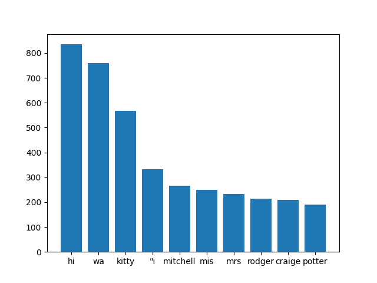

## Reflection
**1. Project Overview** [~1 paragraph]
What data source(s) did you use and what technique(s) did you use analyze/process them? What did you hope to learn/create?
* The project focus on learning about the structure and content of the book provided by gutenberg. 
* In this project, I looked into analizing the following perspectives of the book:
1. what are the word counts for the book in terms of each individual word
2. what are the most frequently appeared words in the book.
3. what are the top ten occured words in the book.
4. For two different books, what words are different in terms of the top ten words of occurance.
5. what is the sentiment score for each individual text
6. what is the difference between the two book's sentiment score (this can determine wether a text have a similar mood to the other)

**2. Implementation** [~2-3 paragraphs]
Describe your implementation at a system architecture level. You should NOT walk through your code line by line, or explain every function (we can get that from your docstrings). Instead, talk about the major components, algorithms, data structures and how they fit together. You should also discuss at least one design decision where you had to choose between multiple alternatives, and explain why you made the choice you did.
* I use the dictionary function and list function a lot for the implementation of this text analysis. I first download the text of the book from gutenberg. Then I foud out that the down loaded text are in the format of string intead of txt. It means that it will not be able to itterate through lines and words. Thus, I am not able to get rid of the header and the text after the end of the project. I subtitude all of the special characters in the file with white space and split the book by white space. This makes the whole book avalible in the format of a list where each word taks one position in the list. Then the text is ready for further analysis.
* Then, I designed the functions to analyze individual words in the documant. The functions will read the list prepared before and turn it in to a dictionary with word:frequency as the key value pairs. Next I deal sort the dictionary by reverse searching the sorted list of values and form a new dictionary to express the key values pairs in a sorted format. In this way, I am able to get the top 10 words that occured the most in the documents.
* After analysing a single text, I am curiouse about what are the difference between two books. Thus, beside the original text The Cat's Paw, I imported another text The Road to Bunker Hill. I compared the difference between the top ten words of the two text and finds out that there are actually quite a difference between the two
* For my last design, I went for the sentiment analysis. I was choosing inbetween analyzing a single text or multiple text. I find out that there are not much significance my reading the sentimental score of one sigle text itself. I decided to develop the function to compare the difference between the sentiment score of two texts by subtracting their score. I believe that this will offer me a better perspective that how are the two text differed in terms of the feeling it offers to the reader, which could be used as a key refernce as the difference of feeling for the reader when they compare the two books.

**3. Results** [~2-3 paragraphs + figures/examples]
Present what you accomplished:

- If you did some text analysis, what interesting things did you find? Graphs or other visualizations may be very useful here for showing your results.
- If you created a program that does something interesting (e.g. a Markov text synthesizer), be sure to provide a few interesting examples of the program's output.

* for the result, we find out that the top 10 occured word in book 1 is: {'hi': 835, 'wa': 759, 'kitty': 567, '"i': 333, 'mitchell': 267, 'mis': 250, 'mrs': 232, 'rodger': 213, 'craige': 209, 'potter': 191}
* and the top 10 occured word in book 2 is: {'wa': 542, 'hi': 512, 'said': 322, 'sally': 273, 'kitty': 253, 'rose': 248, 'back': 169, 'tom': 161, 'men': 161, '“i': 160}
* The difference between the two books interms of the top words are['"i', 'mitchell', 'mis', 'mrs', 'rodger', 'craige', 'potter', 'said', 'sally', 'rose', 'back', 'tom', 'men', '“i']
* The i component is in the preciouse list because of the techical issue of crubing. After scrubing it, the list will provide the true word difference.
* I have also generated a barchart for the top 10 words in the first book

* It is interesting to see that Hi is the word that occur the most which means that the book will have a lot of conversations and it incolves meating another people in the context. In the difference word list, we can find out that names are the ones that differs the two text, which we can probably inffered from the list that the name occured in the top are maybe the name of the main character.

* In terms of the sentiment score:
* the sentiment analysis for book 1 is {'neg': 0.096, 'neu': 0.805, 'pos': 0.099, 'compound': 0.9999}
* the sentiment analysis for book 2 is {'neg': 0.081, 'neu': 0.829, 'pos': 0.09, 'compound': 1.0}
* the two text are very similar to each other which most of the text is in the sentiment of neutrual, we can also observe this from the difference of the two scores, the difference between them are actually very small. It means that the two book should offer the viewers a similar feeling to each other interms of the sentiments
* the diffence in the scores of sentiment analysis between book 1 and 2 is: {'neg': 0.015, 'neu': -0.02399999999999991, 'pos': 0.009000000000000008, 'compound': -9.999999999998899e-05}

**4. Reflection** [~1 paragraph]
From a process point of view, what went well? What could you improve? Other possible reflection topics: Was your project appropriately scoped? Did you have a good plan for testing? How will you use what you learned going forward? What do you wish you knew before you started that would have helped you succeed?

* The entire project went well and definitly make me think a lot about what is significant about each of the matrix reflected from the program. I believe that the text in string format is the most difficult thing for me and I would very much apreciate if a txt file is provided. This will maka  lot difference for me. In terms of what I can improve, I believe that I would very much be happy to study about something like twitter search result analysis to include what is the sentiment and similarity for the top results regarding to different topics. I would like to spend more time possibly to dig into that and learn about it. I wish that I would be able to learn about some matrix and possibily reflectors about what can be something good to indicate the statistics of a text. I believe that this could help me a lot interms of the analysis.